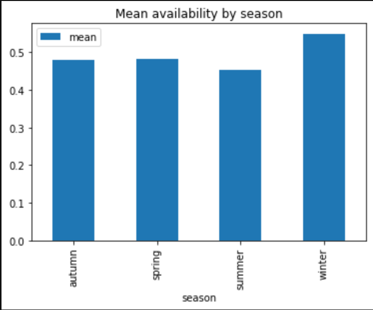
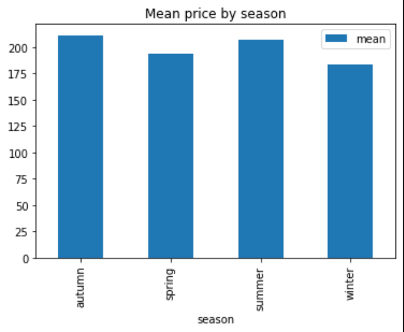
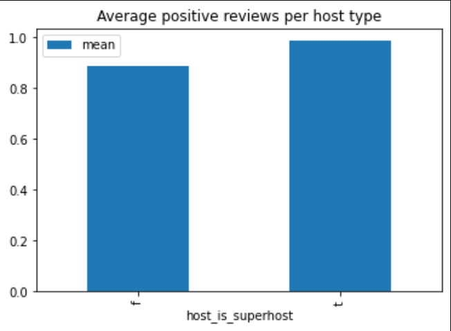
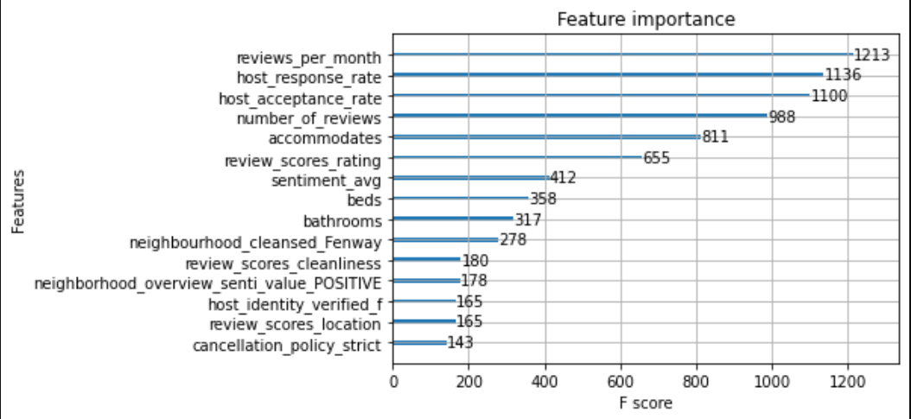

# Is summer the best Season for Boston's AirBNB?

Airbnb has a great business model with hosts providing regular homes for travelers to stay in, it provides travellers with a local home in every city they go to. But are all airbnbs created equal?

In this blogpost we take a fresh look at the Boston's AirBNB dataset from kaggle that can be found here:
https://www.kaggle.com/airbnb/boston

The dataset describe the airbnb's listings activity in Boston inclusing information listing availabilty, price, reviews and description. The data will be analyzed following the Cross-industry standard process for data mining or CRISP-DM methodlogy.
The analysis follows the major phases of CRISP-DM, starting by Business Understanding, Data understanding, Data preperation, Modeling and finally Evaluation.

This project is to analyse the AirBNB Boston dataset to explore and better understand airbnb listings in Boston. How the listings and their pricing is affected by seasonality, neighberhoods and hosts. Questions the analysis tries to answer:
### What is the average availability by season? Does the price change by season?
### Are super hosts less likely to get negative reviews than regular hosts?
### Can we predict listing price? What are the main factors influencing a listing price?

## What is the average availability by season? Does the price change by season?
First looking how seasonality affects the airbnb listings from an availability and pricing prespective:
### Availability by season

As expected summer is the season with the lowest average availability, followed by autumn, spring and winter. This align with expectations for anyone familiar with Boston's weather patterns.

Next we look at the average price by season, unexpectedly Autumn hast the highest mean price and not summer. This is an interesting finding that might be unique to Boston as a city and is definetly worthy of further exploration. Is the price hike driven by high end schools in the new school year? Only deeper analysis will tell.
### Price by season

## Are super hosts less likely to get negative reviews than regular hosts?
To answer this question a pre-trained sentiment analysis model from the flair library is ran againt all the reviews, then average sentiment is calculated per listing then grouped by host type.
### Average positibe reviews per host type

The results are interesting super hosts are more likely to get positive reviews than regular hosts, which explain the word "Super" designated by AirBNB. Well deserved

## Can we predict listing price? What are the main factors influencing a listing price?
To answer this question, the regular Data Science practive is followed. The data is cleaned with unique and monotonic variable removed. Then categorical data with reasonable level count is transformed using one hot encoding. Finally the data is split and an Xgboost model is trained.

With alsmot default parameters the model has an RMSE of 126.7, while there is room for improvement the model explain the data good enough to look into the main driving features.

### Model Feature Importance

the number of reviews per month + host response rate seems to contribute heavily to the unit price. It is likely that more popular and expensive unit get more reivews per month. The higher the demand the higher the price (potentially). So the old rule of supply and demand still apply in Boston.

# Take the data for a spin
This analysis just scratched the surface on what insight is possible to extract from the AirBNB data. We just looked at one city (Boston) other cities are freely available on Kaggle. Maybe it your turn to go check the data for yourself and explore it further standalone or combined with other cities data. My noebook is available here: https://github.com/johnghaly/udacity-ds-nano-jg/blob/main/airbnb_boston.ipynb with the details steps of the analsyis. Feel free to check it out as a good starting point.
